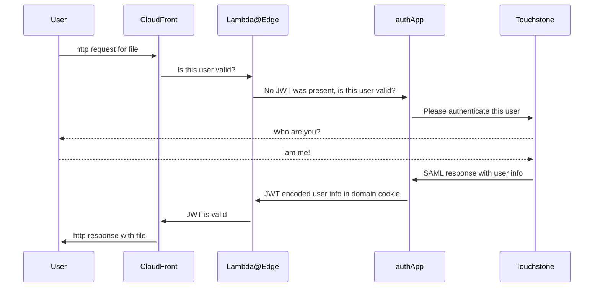

# CDN-AUTH-GEO

CDN-AUTH-GEO is a flask web application that handles MIT Touchstone authentication via a SAML SP for accessing files
in our AWS CloudFront CDN.

Requests to the CDN are sent to this app via a lambda@edge function (not in this repository) if they do not contain a
valid JWT Token.

This application will be responsible for:

- redirecting users without a valid JWT Token to MIT Touchstone
- processing valid user information from MIT Touchstone
- encoding user information into an expiring JWT Token
- sending the user back to the initial CDN file they were requesting (where the lambda@edge function will validate the
  JWT Token and allow access if it is valid)

## How does this application integrate with others?

The following sequence diagram describes a User requesting a file from CloudFront, which is processed by the Lambda@Edge function which checks for a valid JWT token, does not find one so redirects to this application "authApp", which redirects to MIT Touchstone for user validation, which redirects back to this application "authApp", which processes the SAML response from Touchstone, creates a JWT Token, then includes that with the request back to CloudFront which has lambda@edge check and verify there is now a valid JWT Token which then allows then sends the user the file they requested.

## External documentation

Not all links are publicly accessible.

- [Touchstone Authentication for S3 access via Lambda@Edge](https://mitlibraries.atlassian.net/wiki/spaces/GDT/pages/3518824497/Touchstone+Authentication+for+S3+access+via+Lambda+Edge)

## How to run this app locally

- Pre-requisite: python 3.12 (if you use `asdf`, `asdf install python 3.12.1`)
- switch to python 3.12 (`asdf shell python 3.12.1` or equivalent)
- confirm you are using python 3.12 (`python --version`)
- pipenv in your python 3.12 install: `pip install pipenv`
  - note: failing to do this may not result in a noticeable problem, but this is still good practice as it will ensure you are using a `pipenv` within the correct version of python instead of one from your default version. Do this every time you install a new python version.
- note: a python virtual environment will be created via `pipenv` when following the next steps if one does not yet exist. If you run into issues at any point, you can remove that virtualenv with `pipenv --rm` from the project root and start over.
- `make` to see useful commands for this application
- Install local dependencies: `make install`
- Run tests: `make test`
- Run linters: `make lint`
- Run dev server: `make run-dev`
  - access localhost:5000 and localhost:5000/ping
- (optional) run prod-mode server locally: `make run-prod`
  - access localhost:8000 and localhost:8000/ping
