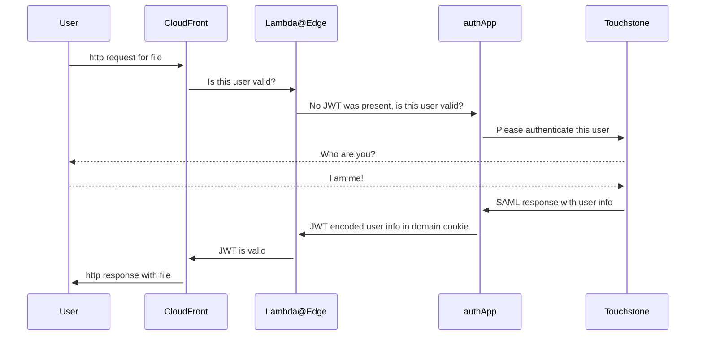

# CDN-AUTH-GEO

CDN-AUTH-GEO is a flask web application that handles MIT Touchstone authentication via a SAML SP for accessing files
in our AWS CloudFront CDN.

Requests to the CDN are sent to this app via a lambda@edge function (not in this repository) if they do not contain a
valid JWT Token.

This application will be responsible for:

- redirecting users without a valid JWT Token to MIT Touchstone
- processing valid user information from MIT Touchstone
- encoding user information into an expiring JWT Token
- sending the user back to the initial CDN file they were requesting (where the lambda@edge function will validate the
  JWT Token and allow access if it is valid)

## How does this application integrate with others?

The following sequence diagram describes a User requesting a file from CloudFront, which is processed by the Lambda@Edge function which checks for a valid JWT token, does not find one so redirects to this application "authApp", which redirects to MIT Touchstone for user validation, which redirects back to this application "authApp", which processes the SAML response from Touchstone, creates a JWT Token, then includes that with the request back to CloudFront which has lambda@edge check and verify there is now a valid JWT Token which then allows then sends the user the file they requested.



## External documentation

Not all links are publicly accessible.

- [Touchstone Authentication for S3 access via Lambda@Edge](https://mitlibraries.atlassian.net/wiki/spaces/GDT/pages/3518824497/Touchstone+Authentication+for+S3+access+via+Lambda+Edge)

## How to run this app locally

This application expects to be developed in docker. [There are dependency issues with libxmlxec1 on macos](https://github.com/SAML-Toolkits/python3-saml/issues/356) at this time and rather than each of us fighting with that, we will develop inside the docker container so it can be solved programatically and repeatably.

Additionally, `lxml` versions newer than 4.9.4 [crash python3-saml](https://github.com/SAML-Toolkits/python3-saml/issues/389)

### General development workflow

- Pre-requisite: docker

- `make app-bash` will build a new container and drop you into a shell. This will be your main interaction point from which you will run other commands. Code is automatically synced between your local environment and the container, so this only needs to be done once per session (or when changing settings in `local.env`).

Within the docker container:

- `make` to see useful commands for this application
- Install local dependencies: `make install` (this is done automatically when starting the bash shell, but if you make changes you can run this again without rebuilding and it should be fine)
- Run tests: `make test`
- Run linters: `make lint`
- Run dev server: `make run-dev`
  - access localhost:5000 and localhost:5000/ping
- (optional) run prod-mode server locally: `make run-prod`
  - access localhost:8000 and localhost:8000/ping

## Required ENV

These values should be set in a `.env` file in the project root for development, and in Heroku config when deployed.

### Application settings

`FLASK_APP` = cdnauth
`FLASK_ENV` = production/development/testing as appropriate

See [Flask docs](https://flask.palletsprojects.com/en/2.3.x/config/#SECRET_KEY) for information on how to properly generate a secret key. Should be unique for each deployment (stage/prod/local).
`SECRET_KEY` = generate a long random string. Used for session security.

`COOKIE_NAME` = This needs to be the same value in this app and the lambda
`COOKIE_DOMAIN` = This needs to match the domain the app and cdn are running in. The app and lambda _must_ run in the same domain. NOTE: in development we set this to `False` due to how cookies work with localhost. Setting the domain to `localhost` is rejected by most browsers. Not setting a value works as expected with localhost.

`JWT_SECRET`  = This must be a long random string and be set to the same value for this app and our lambda


### Identity Provider (IdP) Settings

See [our dev docs](https://mitlibraries.github.io/guides/authentication/touchstone_saml.html#configuring-the-application) for how to obtain the IDP settings
`IDP_CERT` = standard IST IDP setting
`IDP_ENTITY_ID` = standard IST IDP setting
`IDP_SSO_URL` = standard IST IDP setting

### Service Provider (SP) settings

Note: See [our dev docs](https://mitlibraries.github.io/guides/authentication/touchstone_saml.html#generating-a-self-signed-certificate-for-touchstone) for information on how to generate SP key/cert. They should be unique for each deployment and backed up to our shared LastPass.

`SP_ACS_URL` = route in this app that handles the response from IDP. domain name of app + /saml/?acs
`SP_CERT` = obtained from self signed cert generated for this app. Note: remove all spaces/linebreaks as well as the "BEGIN" and "END" lines from file for ENV setting.
`SP_ENTITY_ID` = domain name of app + /saml
`SP_KEY` = obtained from self signed key generated for this app
`SP_SECURITY_ASSERTIONS_ENCRYPTED` (optional) = Boolean. Defaults to `True` in production and `False` in development.
`URN_UID` (optional) = where in the SAML response to get the user info from. Default values are set to work with Touchstone in production and our test IdP in development.

### Running a local Identity Provider (IdP)

Touchstone is our production IdP, but cannot be used for development work.

If you are working on a feature and you want to test the full authentication process, using a local IdP can help. It won't be exactly the same as Touchstone so you'll want to test closely in staging, but it often is helpful enough to be worth using.

#### Using Simple SAML IdP in a Container

The docker composer file `idp-compose.yaml` is configured to allow an SP (this app!) to connect.

To start the IdP

```bash
docker compose -f idp-compose.yaml up
```

The IdP comes pre-configured with test users:

```text
name: user1
password: password

name: user2
password: password
```

If you need to access the IdP admin interface, the credentials are:

```text
name: admin
password: secret
```

Your `.env` file will need to be updated to have the following values for IdP related settings:

```yaml
IDP_CERT=MIICmjCCAYICCQDX5sKPsYV3+jANBgkqhkiG9w0BAQsFADAPMQ0wCwYDVQQDDAR0ZXN0MB4XDTE5MTIyMzA5MDI1MVoXDTIwMDEyMjA5MDI1MVowDzENMAsGA1UEAwwEdGVzdDCCASIwDQYJKoZIhvcNAQEBBQADggEPADCCAQoCggEBAMdtDJ278DQTp84O5Nq5F8s5YOR34GFOGI2Swb/3pU7X7918lVljiKv7WVM65S59nJSyXV+fa15qoXLfsdRnq3yw0hTSTs2YDX+jl98kK3ksk3rROfYh1LIgByj4/4NeNpExgeB6rQk5Ay7YS+ARmMzEjXa0favHxu5BOdB2y6WvRQyjPS2lirT/PKWBZc04QZepsZ56+W7bd557tdedcYdY/nKI1qmSQClG2qgslzgqFOv1KCOw43a3mcK/TiiD8IXyLMJNC6OFW3xTL/BG6SOZ3dQ9rjQOBga+6GIaQsDjC4Xp7Kx+FkSvgaw0sJV8gt1mlZy+27Sza6d+hHD2pWECAwEAATANBgkqhkiG9w0BAQsFAAOCAQEAm2fk1+gd08FQxK7TL04O8EK1f0bzaGGUxWzlh98a3Dm8+OPhVQRi/KLsFHliLC86lsZQKunYdDB+qd0KUk2oqDG6tstG/htmRYD/S/jNmt8gyPAVi11dHUqW3IvQgJLwxZtoAv6PNs188hvT1WK3VWJ4YgFKYi5XQYnR5sv69Vsr91lYAxyrIlMKahjSW1jTD3ByRfAQghsSLk6fV0OyJHyhuF1TxOVBVf8XOdaqfmvD90JGIPGtfMLPUX4m35qaGAU48PwCL7L3cRHYs9wZWc0ifXZcBENLtHYCLi5txR8c5lyHB9d3AQHzKHMFNjLswn5HsckKg83RH7+eVqHqGw==
IDP_ENTITY_ID=http://localhost:8080/simplesaml/saml2/idp/metadata.php
IDP_SSO_URL=http://localhost:8080/simplesaml/saml2/idp/SSOService.php
```

Note: It's unclear if that IdP cert is fully stable, but so far it has survived a few container rebuilds. If it stops working, remove it from this README and you can get the proper value after the IdP is running from the metadata at:

<http://localhost:8080/simplesaml/saml2/idp/metadata.php?output=xhtml>

Remember while these are the IdP settings to change in `.env`, you will still need to configure the rest of this application appropriately including the SP related config.

If using `make app-bash` followed by `make run-dev`, these values are likely what you want to use.

```yaml
SP_ACS_URL=http://localhost:5000/saml/?acs
SP_ENTITY_ID=http://localhost:5000/saml
```

You should generate a cert/key combo to populate `SP_CERT` and `SP_KEY`. See `Service Provider (SP) settings` above for details.
